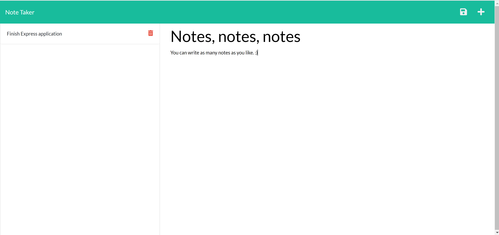

# Note-Taker

This is a note-taker application that utilizes Node.js and Express. It can be used to keep track of notes or other information. This application utilizes persistent data to write and save notes that may be deleted when no longer needed. These notes are stored as JSON data on the backend.

## Installation

1. Clone the repository
2. Use `npm install` via Node.js to install your npm packages

## Usage

* Please open your browser and type in the following URL:
  
  `http://localhost:3000/`

## Deployed Link:
  https://mighty-anchorage-28221.herokuapp.com/

## Screenshot:

## Tools:
I used the following  tools:

1. JavaScript
2. Node.js
3. Express

## Built with:

1. Visual Studio Code
2. Chrome DevTools
3. Markdown

## Author:

Nick Mullenmeister
